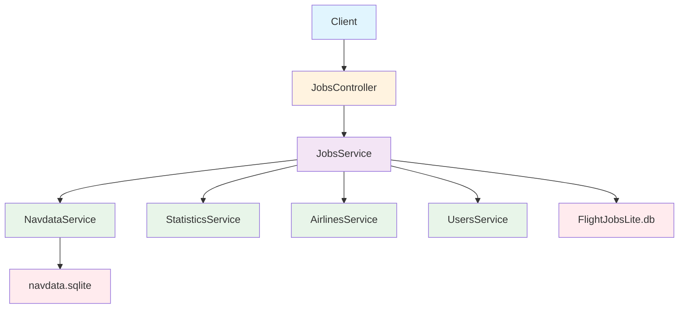

# Plano de Implementação: StartJob e FinishJob

## Análise da Aplicação Legada

### 1. StartJobMSFS (Legado)

**Localização:** [`JobApiController.cs:35-58`](FlightJobs/Controllers/JobApiController .cs:35)

**Fluxo:**
1. Recebe `Latitude` e `Longitude` do **Header** da requisição
2. Usa `SqLiteDbContext.GetCloseAirport()` para encontrar aeroporto mais próximo no `navdata.sqlite`
3. Recebe `Payload`, `UserId`, `FuelWeight` do **Header**
4. Chama método privado `StartJob(airport.Ident, payloadStr, userIdStr, fuelWeightStr)`

**Lógica do StartJob privado:** [`JobApiController.cs:177-238`](FlightJobs/Controllers/JobApiController .cs:177)
- Busca job do usuário com `IsActivated = true` pelo ICAO de partida
- Suporta ICAO de 3 caracteres (match parcial) ou 4 caracteres (match exato)
- Validações:
  - Job existe e está ativado
  - Challenge não está expirado
  - Usuário não é GUEST
  - Payload está dentro de ±150kg do job
- Atualiza job: `StartFuelWeight`, `InProgress = true`, `StartTime = DateTime.Now`
- Verifica se licença do piloto está expirada
- Retorna mensagem de sucesso com `arrival-icao` no header

### 2. FinishJobMsfsPost (Legado)

**Localização:** [`JobApiController.cs:63-90`](FlightJobs/Controllers/JobApiController .cs:63)

**Fluxo:**
1. Recebe `JobStatusTO` no **Body** da requisição
2. Usa `SqLiteDbContext.GetCloseAirport()` para encontrar aeroporto mais próximo
3. Chama método `FinishJob()` com dados do DTO
4. Após finalizar, busca o job finalizado e retorna junto com mensagem

**DTO JobStatusTO:** [`JobStatusTO.cs`](FlightJobs/DTOs/JobStatusTO.cs)
```csharp
public class JobStatusTO {
    public string UserId { get; set; }
    public string Title { get; set; }
    public double Latitude { get; set; }
    public double Longitude { get; set; }
    public double PayloadKilograms { get; set; }
    public double FuelWeightKilograms { get; set; }
    public IList<string> ResultMessages { get; set; }
    public long ResultScore { get; set; }
}
```

**Lógica do FinishJob privado:** [`JobApiController.cs:240-338`](FlightJobs/Controllers/JobApiController .cs:240)
- Busca job do usuário com `IsActivated = true` E `InProgress = true` pelo ICAO de chegada OU alternativo
- Suporta ICAO de 3 caracteres (match parcial) ou 4 caracteres (match exato)
- Validações:
  - Job existe e está em progresso
  - Challenge não está expirado
  - Usuário não é GUEST
  - Payload está dentro de ±150kg do job
  - Tempo de voo mínimo: `(dist * 11) / 100` minutos
  - Combustível queimado mínimo: `(dist * payload * 0.12) / 1000`
- Atualiza job: `InProgress = false`, `EndTime`, `IsDone = true`, `IsActivated = false`, `ModelName`, `ModelDescription`, `FinishFuelWeight`
- Chama `UpdateStatistics()` para atualizar pontuação e saldo do piloto
- Chama `UpdateAirline()` para atualizar dados da airline se houver
- Retorna mensagem de sucesso

### 3. UpdateStatistics (Legado)

**Localização:** [`JobApiController.cs:340-383`](FlightJobs/Controllers/JobApiController .cs:340)

**Lógica:**
- Busca estatísticas do usuário em `StatisticsDbModels`
- Se existe e licença NÃO expirada:
  - Se `jobPilotScore` fornecido: usa esse valor
  - Senão: calcula baseado em `AviationType` (type 1: `dist/10`, type 2: `dist/15`)
  - Adiciona `job.Pay` ao `BankBalance`
- Se não existe: cria novo `StatisticsDbModel`

### 4. UpdateAirline (Legado)

**Localização:** [`JobApiController.cs:385-434`](FlightJobs/Controllers/JobApiController .cs:385)

**Lógica:**
- Se piloto pertence a uma airline (`statistics.Airline != null`):
  - Cria `JobAirlineDbModel`
  - Calcula receita/custo do voo via `jobAirline.CalcAirlineJob(departureFbo)`
  - Se airline tem dívida vencida (`DebtValue > 0 && DebtMaturityDate < Now`): perde metade da receita
  - Senão: ganha pontuação e receita
  - Aplica débitos se airline comprada (`UserId` não vazio)
  - Envia email de alerta se necessário

**Cálculos do JobAirline:** [`JobAirlineDbModel.cs:55-103`](FlightJobs/Models/JobAirlineDbModel.cs:55)
```
FuelPrice = AviationType > 1 ? 5.20 : 5.70
FlightCrewCost = JobPay + (JobPay * 0.8)
GroundCrewCost = FlightCrewCost * 0.3
FuelCost = (StartFuelWeight - FinishFuelWeight) * FuelPrice
FuelCostPerNM = FuelCost / Dist
FlightAttendantCost = (Pax / 60) * (21 * FlightTimeHours)
TotalCrewCostLabor = FlightCrewCost + FlightAttendantCost
TotalFlightCost = TotalCrewCostLabor + FuelCost + GroundCrewCost
RevenueEarned = TotalFlightCost * 1.35
FlightIncome = RevenueEarned - TotalFlightCost
```

### 5. IsLicenseOverdue (Legado)

**Localização:** [`JobApiController.cs:436-442`](FlightJobs/Controllers/JobApiController .cs:436)

**Lógica:**
- Verifica se existe `PilotLicenseExpensesUser` com `MaturityDate < DateTime.Now` para o usuário

**Model:** [`PilotLicenseExpensesUserDbModel.cs`](FlightJobs/Models/PilotLicenseExpensesUserDbModel.cs)
```csharp
public class PilotLicenseExpensesUserDbModel {
    public long Id { get; set; }
    public virtual ApplicationUser User { get; set; }
    public DateTime MaturityDate { get; set; }
    public bool OverdueProcessed { get; set; }
}
```

### 6. SqLiteDbContext.GetCloseAirport (Legado)

**Localização:** [`SqLiteDbContext.cs:142-170`](FlightJobs.Domain.Navdata/SqLiteDbContext.cs:142)

**Lógica:**
- Busca aeroportos num raio de ±2 graus de lat/lon
- Filtra aeroportos com pelo menos 1 pista (`NumRunways > 0`)
- Ordena por distância usando `GeoCoordinate.GetDistanceTo()`
- Retorna o mais próximo dentro de 15000 metros

---

## Plano de Implementação na Nova API

### Arquitetura Proposta



### DTOs Necessários

#### StartJobDto
```typescript
export class StartJobDto {
  @IsNumber()
  latitude: number;      // Para encontrar aeroporto de partida

  @IsNumber()
  longitude: number;     // Para encontrar aeroporto de partida

  @IsNumber()
  payloadKilograms: number;

  @IsNumber()
  fuelWeightKilograms: number;
}
```

#### FinishJobDto
```typescript
export class FinishJobDto {
  @IsNumber()
  latitude: number;       // Para encontrar aeroporto de chegada

  @IsNumber()
  longitude: number;      // Para encontrar aeroporto de chegada

  @IsNumber()
  payloadKilograms: number;

  @IsNumber()
  fuelWeightKilograms: number;

  @IsOptional()
  @IsString()
  modelName?: string;

  @IsOptional()
  @IsString()
  modelDescription?: string;

  @IsOptional()
  @IsArray()
  @IsString({ each: true })
  resultMessages?: string[];

  @IsOptional()
  @IsNumber()
  resultScore?: number;
}
```

#### StartJobResponse
```typescript
export class StartJobResponse {
  success: boolean;
  message: string;
  arrivalIcao: string;
  licenseExpired: boolean;
}
```

#### FinishJobResponse
```typescript
export class FinishJobResponse {
  success: boolean;
  message: string;
  finishedJob: Job;
  licenseExpired: boolean;
}
```

### Endpoints Propostos

| Método | Endpoint | Descrição | Auth |
|--------|----------|-----------|------|
| POST | `/api/jobs/start` | Iniciar um voo | JWT |
| POST | `/api/jobs/finish` | Finalizar um voo | JWT |

### Validações a Implementar

#### StartJob
1. Encontrar aeroporto mais próximo pelas coordenadas (navdata.sqlite)
2. Buscar job ativado do usuário pelo ICAO de partida
3. Verificar se challenge não expirou
4. Verificar se usuário não é GUEST
5. Validar payload ±150kg
6. Atualizar job com fuel weight, start time, in progress
7. Verificar se licença do piloto está expirada

#### FinishJob
1. Encontrar aeroporto mais próximo pelas coordenadas (navdata.sqlite)
2. Buscar job em progresso do usuário pelo ICAO de chegada/alternativo
3. Verificar se challenge não expirou
4. Verificar se usuário não é GUEST
5. Validar payload ±150kg
6. Validar tempo mínimo de voo: `(dist * 11) / 100` minutos
7. Validar combustível queimado mínimo: `(dist * payload * 0.12) / 1000`
8. Atualizar job com dados de finalização
9. Atualizar estatísticas do piloto
10. Atualizar dados da airline se aplicável
11. Retornar job finalizado junto com mensagem

### Estrutura de Arquivos a Criar/Modificar

```
modernization/backend/src/
├── navdata/
│   ├── navdata.module.ts           # NOVO
│   ├── navdata.service.ts          # NOVO - acesso ao navdata.sqlite
│   └── entities/
│       └── airport.entity.ts       # NOVO - mapeamento da tabela airport
├── jobs/
│   ├── jobs.controller.ts          # MODIFICAR - adicionar endpoints
│   ├── jobs.service.ts             # MODIFICAR - adicionar lógica completa
│   ├── jobs.module.ts              # MODIFICAR - importar módulos necessários
│   └── dto/
│       ├── start-job.dto.ts        # NOVO
│       └── finish-job.dto.ts       # NOVO
├── statistics/
│   ├── statistics.service.ts       # MODIFICAR - adicionar UpdateStatistics
│   └── entities/
│       └── statistics.entity.ts    # JÁ EXISTE
├── airlines/
│   ├── airlines.service.ts         # MODIFICAR - adicionar UpdateAirline
│   └── entities/
│       └── airline.entity.ts       # JÁ EXISTE
├── licenses/
│   ├── licenses.module.ts          # NOVO
│   ├── licenses.service.ts         # NOVO
│   └── entities/
│       └── pilot-license-expense.entity.ts  # NOVO
├── job-airlines/
│   ├── job-airlines.module.ts      # NOVO
│   ├── job-airlines.service.ts     # NOVO
│   └── entities/
│       └── job-airline.entity.ts   # NOVO
└── common/
    └── utils/
        └── data-conversion.util.ts # NOVO
```

### Configuração do Navdata SQLite

O banco `navdata.sqlite` está em `FlightJobs.Domain.Navdata/navdata.sqlite`. Precisamos:

1. Copiar o arquivo para o diretório da nova API ou referenciar o caminho
2. Usar `better-sqlite3` diretamente (já está no package.json)
3. Criar entidade/mapeamento para a tabela `airport`

### Tabela Airport no navdata.sqlite

Colunas baseadas em [`AirportEntity.cs`](FlightJobs.Domain.Navdata/Entities/AirportEntity.cs):
| Coluna SQLite | Tipo | Descrição |
|---------------|------|-----------|
| airport_id | INTEGER | PK |
| ident | TEXT | ICAO code |
| name | TEXT | Nome do aeroporto |
| city | TEXT | Cidade |
| state | TEXT | Estado |
| has_avgas | INTEGER | Tem avgas |
| has_jetfuel | INTEGER | Tem jet fuel |
| is_military | INTEGER | É militar |
| longest_runway_length | INTEGER | Comprimento da pista |
| longest_runway_width | INTEGER | Largura da pista |
| longest_runway_heading | REAL | Direção da pista |
| longest_runway_surface | TEXT | Superfície da pista |
| num_runways | INTEGER | Número de pistas |
| mag_var | REAL | Variação magnética |
| altitude | INTEGER | Altitude |
| lonx | REAL | Longitude |
| laty | REAL | Latitude |

### Entidades que Precisam ser Criadas

#### PilotLicenseExpenseUser
```typescript
@Entity('pilotlicenseexpensesuserdbmodels')
export class PilotLicenseExpenseUser {
  @PrimaryGeneratedColumn({ name: 'Id' })
  id: number;

  @ManyToOne(() => User)
  @JoinColumn({ name: 'User_Id' })
  user: User;

  @Column({ name: 'MaturityDate', type: 'datetime' })
  maturityDate: Date;

  @Column({ name: 'OverdueProcessed', default: false })
  overdueProcessed: boolean;
}
```

#### JobAirline
```typescript
@Entity('jobairlinedbmodels')
export class JobAirline {
  @PrimaryGeneratedColumn({ name: 'Id' })
  id: number;

  @ManyToOne(() => Airline)
  @JoinColumn({ name: 'Airline_Id' })
  airline: Airline;

  @ManyToOne(() => Job)
  @JoinColumn({ name: 'Job_Id' })
  job: Job;

  @Column({ name: 'JobDebtValue', default: 0 })
  jobDebtValue: number;

  // Campos calculados (não persistidos)
  @Column({ name: 'FuelPrice', default: 0 })
  fuelPrice: number;

  @Column({ name: 'FuelCost', default: 0 })
  fuelCost: number;

  @Column({ name: 'GroundCrewCost', default: 0 })
  groundCrewCost: number;

  @Column({ name: 'FlightCrewCost', default: 0 })
  flightCrewCost: number;

  @Column({ name: 'FlightAttendantCost', default: 0 })
  flightAttendantCost: number;

  @Column({ name: 'TotalCrewCostLabor', default: 0 })
  totalCrewCostLabor: number;

  @Column({ name: 'TotalFlightCost', default: 0 })
  totalFlightCost: number;

  @Column({ name: 'RevenueEarned', default: 0 })
  revenueEarned: number;

  @Column({ name: 'FlightIncome', default: 0 })
  flightIncome: number;
}
```

---

## Implementação Passo a Passo

### Passo 1: DTOs
- Criar `start-job.dto.ts` com validações class-validator
- Criar `finish-job.dto.ts` com validações class-validator

### Passo 2: Módulo Navdata
- Criar `navdata.module.ts` com provider de conexão SQLite (better-sqlite3)
- Criar `navdata.service.ts` com método `getCloseAirport(lat, lon)`
- Implementar lógica de busca por bounding box ±2 graus
- Ordenar por distância haversine e retornar mais próximo dentro de 15km

### Passo 3: Entidades Novas
- Criar `pilot-license-expense.entity.ts`
- Criar `job-airline.entity.ts`
- Atualizar TypeORM para incluir essas entidades

### Passo 4: Utilitários
- Criar `data-conversion.util.ts` com `convertKilogramsToPounds()`
- Criar `geo-calculations.util.ts` com cálculo de distância haversine

### Passo 5: Jobs Service
- Implementar `startJob()` com todas as validações
- Implementar `finishJob()` com todas as validações
- Implementar `updateStatistics()`
- Implementar `updateAirline()` com cálculos de JobAirline
- Implementar `isLicenseOverdue()`

### Passo 6: Jobs Controller
- Adicionar endpoint `POST /start`
- Adicionar endpoint `POST /finish`
- Usar JWT auth (userId do token, não do body)

### Passo 7: Testes
- Testar com requests equivalentes aos da app legada

---

## Diferenças da Nova API

| Aspecto | Legado | Nova API |
|---------|--------|----------|
| Parâmetros | Headers | Body (JSON) |
| Autenticação | UserId no header | JWT Token |
| Navdata | Entity Framework + SQLite | better-sqlite3 direto |
| Logging | ELMAH | NestJS Logger |
| Email | ASP.NET Identity Email | Serviço de email separado |
| Response | HttpResponseMessage | DTO tipado |
| Payload tolerance | ±150kg | ±150kg (mesmo) |
| Min flight time | (dist * 11) / 100 min | (dist * 11) / 100 min (mesmo) |
| Min fuel burn | (dist * payload * 0.12) / 1000 | (dist * payload * 0.12) / 1000 (mesmo) |

---

## Exemplos de Requests

### StartJob
```bash
POST /api/jobs/start
Authorization: Bearer <jwt_token>
Content-Type: application/json

{
  "latitude": -23.4356,
  "longitude": -46.4731,
  "payloadKilograms": 1200,
  "fuelWeightKilograms": 500
}
```

### FinishJob
```bash
POST /api/jobs/finish
Authorization: Bearer <jwt_token>
Content-Type: application/json

{
  "latitude": -25.5284,
  "longitude": -49.1758,
  "payloadKilograms": 1200,
  "fuelWeightKilograms": 300,
  "modelName": "PR-ABC",
  "modelDescription": "Cessna 172",
  "resultMessages": ["Landing was smooth"],
  "resultScore": 100
}
```

---

## Notas Importantes

1. **GUEST Check**: O legado verifica se `job.User.Email == AccountController.GuestEmail`. Na nova API, isso pode ser implementado verificando se o email é igual a um valor configurado ou usando uma flag no usuário.

2. **ICAO Match de 3 caracteres**: O legado suporta match parcial quando o ICAO tem 3 caracteres (ex: `BCT` match com `SBCT`). Isso é útil quando o simulador retorna apenas os últimos 3 caracteres.

3. **Timezone**: O legado usa `DateTime.Now` que é server time. Na nova API, usar `new Date()` (UTC) é mais apropriado.

4. **Email de Airline Debt**: O envio de email é feito async via `Task.Factory.StartNew()`. Na nova API, pode-se usar Bull queue ou similar.

5. **Navdata Performance**: A query do navdata usa um bounding box de ±2 graus para reduzir o número de aeroportos antes de calcular distâncias. Isso deve ser mantido para performance.
